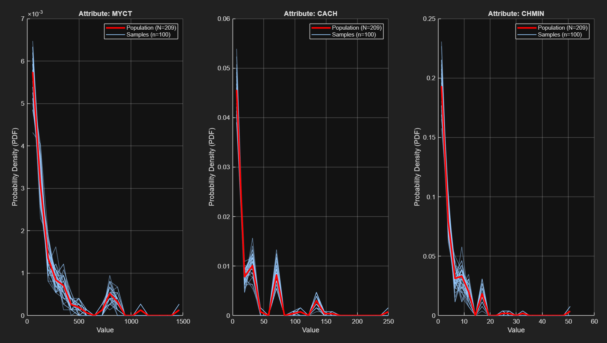
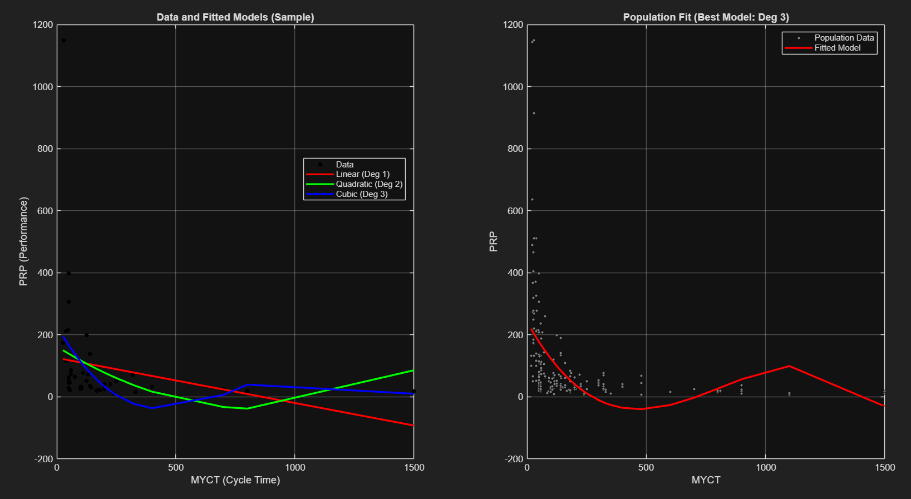

# Data Analysis: CPU Performance Study | Group 7

A comprehensive statistical study and predictive modeling project based on the Kibler & Aha (1988) CPU dataset, implemented in MATLAB. The analysis covers the full data science pipeline: from exploratory statistics and hypothesis testing to advanced regression and dimensionality reduction.

## 📊 Project Overview
The analysis is performed on a dataset of 209 observations across 9 variables, including cycle times, memory capacity, and Published Performance (PRP).

### Key Methodologies
* **Exploratory Data Analysis:** Empirical PDF modeling and histogram fitting.
* **Hypothesis Testing:** Chi-square ($X^2$) goodness-of-fit, Student's t-tests, and Correlation testing (Fisher transformation).
* **Resampling Techniques:** Bootstrap methods for robust confidence interval estimation.
* **Predictive Modeling:** Simple, Multiple Linear, and Polynomial Regression.
* **Advanced Selection:** Principal Component Regression (PCR) and LASSO regularization.

## 📈 Key Results & Visualizations

### 1. Distribution & Modeling
Detailed analysis of variables to determine underlying distributions. We used Chi-square tests to validate the fit of theoretical models to empirical data.

[Image of histogram with a fitted probability density function curve]

### 2. Regression & Diagnostic Analysis
We evaluated various regression models to capture the dependency of PRP on technical specifications. The comparison between linear and polynomial fits helped identify the optimal model complexity.

[Image of various regression models compared on a scatter plot]
*Figure: Comparison of Linear, Quadratic, and Cubic models on sample data (left) and the final 3rd-degree polynomial model (right).*

### 3. Predictive Model Selection (Ex. 10)
To address multicollinearity and improve generalization, we compared the Full Linear Model against PCR and LASSO on a 35% validation set.

| Modeling Strategy | MSE (Validation Set) | Key Advantage |
| :--- | :---: | :--- |
| **Full Linear Model** | *[Insert MSE]* | Baseline accuracy |
| **PCR** | *[Insert MSE]* | Multicollinearity mitigation |
| **LASSO** | *[Insert MSE]* | Feature sparsity & selection |

## 📂 Repository Structure
The project is divided into 10 distinct exercises. Each folder follows a modular dual-file structure:

* 📂 **`Exercises/`**: Subfolders `Ex01` to `Ex10` containing:
    * 📄 `Group7ExiFun1.m`: The core function implementing the statistical logic.
    * 📄 `Group7ExiProg1.m`: The main script for data loading and plotting.
* 📂 **`Data/`**: Contains `CPUPerformance.xls`.
* 📂 **`Plots/`**: High-resolution visualization highlights.
* 📄 **`Full_Report.pdf`**: Comprehensive technical analysis and interpretations.

## 🛠️ Tech Stack
* **Language:** MATLAB
* **Toolboxes:** Statistics and Machine Learning Toolbox
* **Data:** Kibler & Aha (1988) CPU Dataset

---
*Developed as part of the Data Analysis course, ECE AUTh, 2026.*
